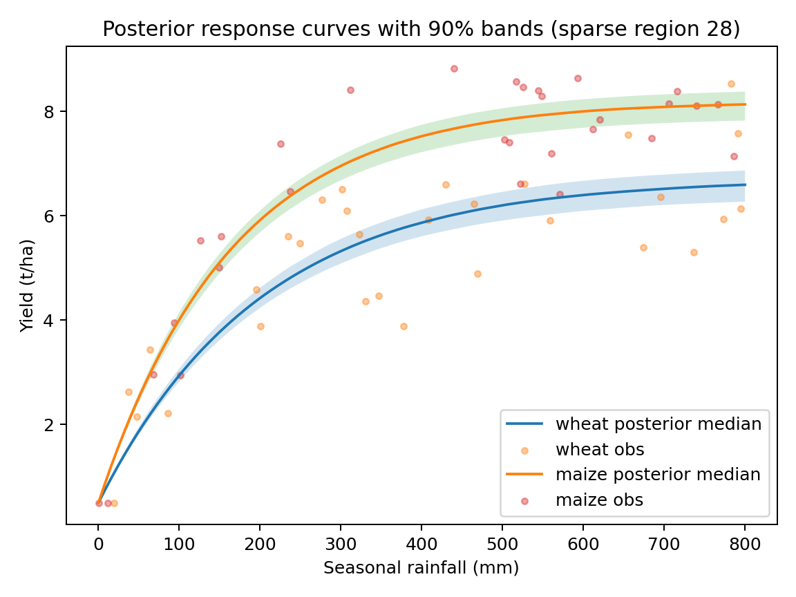

# Synthetic Results (Cross-Crop + Cross-Region)

This page shows the full pipeline on synthetic data:

- Physics-informed **saturating** yield response curve
- Per (crop, region) curve fitting
- ML prediction of curve parameters from region covariates + crop identity
- Bayesian cross-crop model with **ML-centered priors**
- In sparse regions, posterior uncertainty widens and parameters shrink toward ML priors

## Posterior response curves (dense vs sparse regions)

### Dense region example

### Sparse region example
